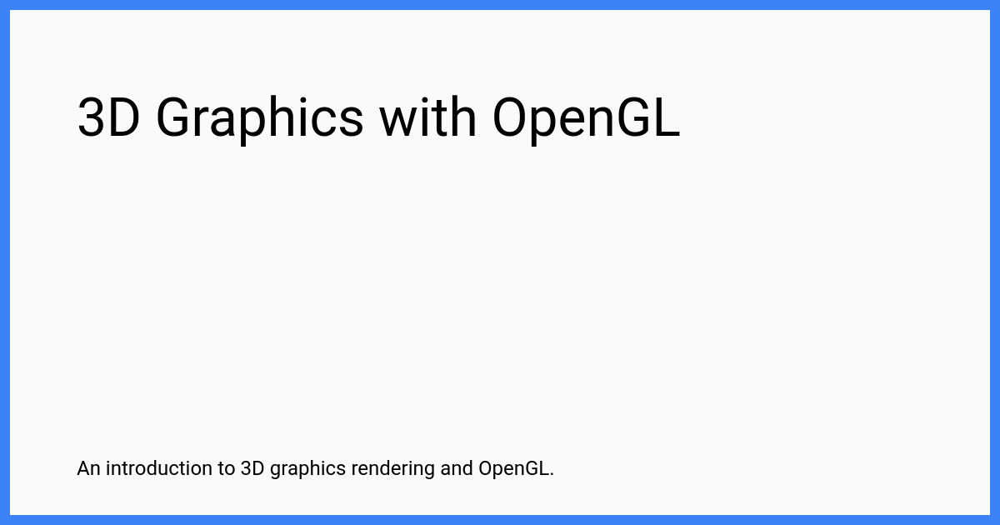
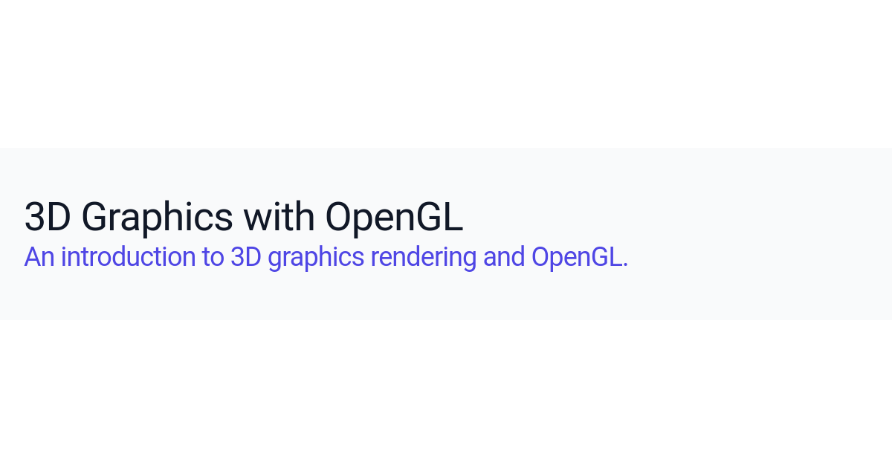

<div align="center">
  <h1>Astro Takumi</h1>

[](https://www.npmjs.com/package/astro-takumi)

Generate Open Graph images for your Astro site using Takumi.

This project is actively maintained. If you have a feature request or need help, please [create an issue](https://github.com/vikas5914/astro-takumi/issues/new).

</div>

## What is Open Graph?

[Open Graph](https://ogp.me/) is a protocol created by Facebook. It allows pages on your site to be richly embedded into other sites and applications.

You've probably seen this in action when posting a link on Facebook, Twitter, Slack, iMessage, or Discord. Links posted in supported applications will display the Open Graph metadata which often includes an image. This library will generate those images for you.

## Features

> [!WARNING]
> This integration has only been tested with statically rendered sites. It is untested with server-side rendering.

- Written in TypeScript
- Generate Open Graph images for every page on your site.
- Use a preset renderer to get started quickly.
- Images are fully customizable using [Takumi](https://github.com/kane50613/takumi).
- **Built-in Tailwind CSS support** - Use `tw` prop directly in JSX.
- Multiple output formats: PNG, WebP, JPEG, AVIF.
- Use React/JSX + Tailwind syntax or vanilla JavaScript to define your own custom images.
- Supports both static pages and Astro content collections.
- Pages can be written in Markdown, MDX, HTML, or any other format.

## Quick Start

1. Add this integration to your Astro config:
   - Option 1: use the `astro` command:

     ```bash
     npx astro add astro-takumi
     ```

   - Option 2: install the package and add the integration to your Astro config:

     ```bash
     npm i astro-takumi
     ```

     ```diff
     +import astroTakumi from "astro-takumi";

     export default defineConfig({
       integrations: [
     +    astroTakumi()
       ],
     });
     ```

1. Install React. React is used by the presets, and can be used to easily author custom images. Note that React is only used for generating the images and will not be shipped to clients.

   ```bash
   npm i -D react
   ```

1. Install the fonts you want to use. Fonts must be explicitly declared to be used for images. System fonts are _not_ available. For this quick start guide, we'll install the [Roboto](https://fontsource.org/fonts/roboto) font:

   ```bash
   npm i @fontsource/roboto
   ```

   You can find more fonts on [Fontsource](https://fontsource.org/), or you can use any font file that you have. Pass font files as Buffers to Takumi.

1. Configure the integration in your Astro config:

   ```diff
   -import astroTakumi from "astro-takumi";
   +import astroTakumi, { presets } from "astro-takumi";

   export default defineConfig({
     integrations: [
   -    astroTakumi()
   +    astroTakumi({
   +      options: {
   +        fonts: [
   +          fs.readFileSync("node_modules/@fontsource/roboto/files/roboto-latin-400-normal.woff"),
   +        ],
   +      },
   +      render: presets.blackAndWhite,
   +    }),
     ],
   });
   ```

1. Set the [`site`](https://docs.astro.build/en/reference/configuration-reference/#site) property in your Astro config:

   Open Graph requires URLs to be absolute, including the domain your site is hosted at. This integration uses the site defined in your Astro config to create the correct URLs for Open Graph which is `site` must be defined.

   ```diff
   export default defineConfig({
   +  site: "https://<your site>.com",
     integrations: [
       astroTakumi({
         options: {
           fonts: [
             fs.readFileSync("node_modules/@fontsource/roboto/files/roboto-latin-400-normal.woff"),
           ],
         },
         render: presets.blackAndWhite,
       }),
     ],
   });
   ```

1. Update your main Astro layout with the appropriate `meta` tags. The [Open Graph site](https://ogp.me/) has more information possible tags.

   The following `meta` tags must be defined:
   - `og:title`
     - This field may be used when generating images.
   - `og:type`
     - See the [Open Graph documentation](https://ogp.me/#types) for valid values.
   - `og:image`
     - Set this to the return value of `getImagePath` (example shown below).
     - If the value of `og:image` does not match what this integration expects then your site will fail to build. This will ensure your site is correctly configured to display Open Graph images.
   - `og:description`
     - Optional. This field may be used when generating images.

   Your site will fail to build if the tags above are not set.
   - Option 1: Use the [`astro-seo`](https://github.com/jonasmerlin/astro-seo) package:

     Install the `astro-seo` package:

     ```bash
     npm i astro-seo
     ```

     Update your Astro layout to use the `SEO` component:

     ```diff
     ---
     +import { SEO } from "astro-seo";
     +import { getImagePath } from "astro-takumi";

     interface Props {
       title: string;
     }

     const { title } = Astro.props;
     +const { url, site } = Astro;
     +const openGraphImageUrl = getImagePath({ url, site });
     ---

     <!doctype html>
     <html lang="en">
       <head>
         <meta charset="UTF-8" />
         <meta name="description" content="Astro description" />
         <meta name="viewport" content="width=device-width" />
         <link rel="icon" type="image/svg+xml" href="/favicon.svg" />
         <meta name="generator" content={Astro.generator} />
         <title>{title}</title>

     +    <SEO
     +      openGraph={
     +        {
     +          basic: {
     +            title: title,
     +            type: "website",
     +            image: openGraphImageUrl,
     +            url: url,
     +          },
     +          optional: {
     +            description: "My page description",
     +          },
     +        }
     +      }
     +    />
       </head>
       <body>
         <slot />
       </body>
     </html>
     ```

   - Option 2: Manually add the `meta` tags to your Astro layout.

1. Build your site. You should see an image file (`.png` by default) next to each `.html` page in your `dist` folder. Double-check that the `og:image` property in your `.html` file matches the path to the image file.

1. Deploy your site. You can verify that your images are correct by:
   - Sending a link to your site in an application that supports Open Graph like iMessage, Slack, Discord, etc.
   - Visit [opengraph.xyz](http://opengraph.xyz/) and test your site.

## Configuration

The integration accepts the following options:

```ts
astroTakumi({
  options: {
    // Required: fonts to use for rendering text
    fonts: [fs.readFileSync("node_modules/@fontsource/roboto/files/roboto-latin-400-normal.woff")],

    // Image dimensions (default: 1200x630)
    width: 1200,
    height: 630,

    // Output format: "png" | "webp" | "jpeg" | "avif" (default: "png")
    // WebP is recommended for better compression
    format: "webp",

    // Image quality 0-100 (default: 100)
    quality: 90,

    // Enable debug borders to troubleshoot layouts (default: false)
    drawDebugBorder: false,

    // Log each generated image (default: false)
    verbose: true,
  },
  render: presets.blackAndWhite,
});
```

### Using WebP Format

For better performance, you can use WebP format which offers smaller file sizes:

```ts
import astroTakumi, { presets, getImagePath } from "astro-takumi";

export default defineConfig({
  integrations: [
    astroTakumi({
      options: {
        format: "webp",
        quality: 85,
        fonts: [...],
      },
      render: presets.blackAndWhite,
    }),
  ],
});
```

Update your layout to use the correct format:

```ts
const openGraphImageUrl = getImagePath({ url, site, format: "webp" });
```

## Examples

There are example sites using this integration under [`examples/`](https://github.com/vikas5914/astro-takumi/tree/main/examples).

### Sites Using This

If you're using this project, [open a PR](https://github.com/vikas5914/astro-takumi/compare) to add your site to this list.

<!-- Add your site here! -->

## Custom Renderers

You can create your own custom images with a render function. Take a look at how [a preset](https://github.com/vikas5914/astro-takumi/blob/main/src/presets/blackAndWhite.tsx) works.

Renderers have access to the page's DOM using [jsdom](https://github.com/jsdom/jsdom). You can use this to render your Open Graph image using any of the content from the associated HTML page. An example of this is shown in the [custom property preset](https://github.com/vikas5914/astro-takumi/blob/main/src/presets/customProperty.tsx) which shows a preview of the page's body text in the Open Graph image.

This library uses [Takumi](https://github.com/kane50613/takumi) to render React/JSX directly to images.

> [!TIP]
> Takumi has **built-in Tailwind CSS support**! Simply use the `tw` prop on any element:
>
> ```tsx
> <div tw="flex items-center justify-center bg-white text-4xl font-bold">{title}</div>
> ```

## Presets

Presets are located in [`src/presets/`](https://github.com/vikas5914/astro-takumi/tree/main/src/presets). [Open a pull request](https://github.com/vikas5914/astro-takumi/compare) to contribute a preset you've created.

All presets use Takumi's built-in Tailwind CSS support via the `tw` prop - no additional dependencies required!

### `backgroundImage`

```diff
import astroTakumi, { presets } from "astro-takumi";

export default defineConfig({
  integrations: [
    astroTakumi({
+      render: presets.backgroundImage,
    }),
  ],
});
```


### `blackAndWhite`

```diff
import astroTakumi, { presets } from "astro-takumi";

export default defineConfig({
  integrations: [
    astroTakumi({
+      render: presets.blackAndWhite,
    }),
  ],
});
```


### `brandedLogo`

```diff
import astroTakumi, { presets } from "astro-takumi";

export default defineConfig({
  integrations: [
    astroTakumi({
+      render: presets.brandedLogo,
    }),
  ],
});
```


### `customProperty`

```diff
import astroTakumi, { presets } from "astro-takumi";

export default defineConfig({
  integrations: [
    astroTakumi({
+      render: presets.customProperty,
    }),
  ],
});
```


### `gradients`

```diff
import astroTakumi, { presets } from "astro-takumi";

export default defineConfig({
  integrations: [
    astroTakumi({
+      render: presets.gradients,
    }),
  ],
});
```


### `podcast`

```diff
import astroTakumi, { presets } from "astro-takumi";

export default defineConfig({
  integrations: [
    astroTakumi({
+      render: presets.podcast,
    }),
  ],
});
```


### `rauchg`

```diff
import astroTakumi, { presets } from "astro-takumi";

export default defineConfig({
  integrations: [
    astroTakumi({
+      render: presets.rauchg,
    }),
  ],
});
```


### `simpleBlog`

```diff
import astroTakumi, { presets } from "astro-takumi";

export default defineConfig({
  integrations: [
    astroTakumi({
+      render: presets.simpleBlog,
    }),
  ],
});
```



### `tailwind`

```diff
import astroTakumi, { presets } from "astro-takumi";

export default defineConfig({
  integrations: [
    astroTakumi({
+      render: presets.tailwind,
    }),
  ],
});
```



### `waveSvg`

```diff
import astroTakumi, { presets } from "astro-takumi";

export default defineConfig({
  integrations: [
    astroTakumi({
+      render: presets.waveSvg,
    }),
  ],
});
```


## Acknowledgment

Based on the excellent work done in the [Takumi](https://github.com/kane50613/takumi) project and the [astro-opengraph-images](https://github.com/shepherdjerred/astro-opengraph-images) project.
